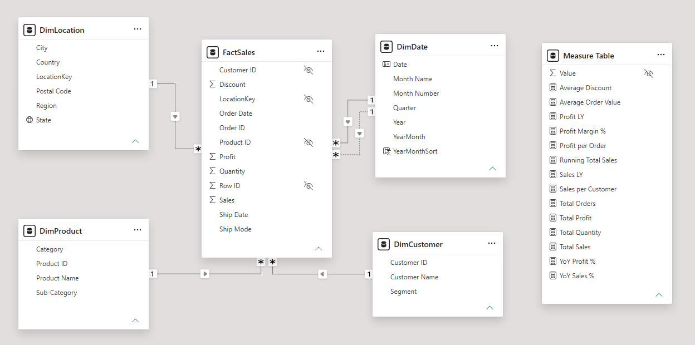
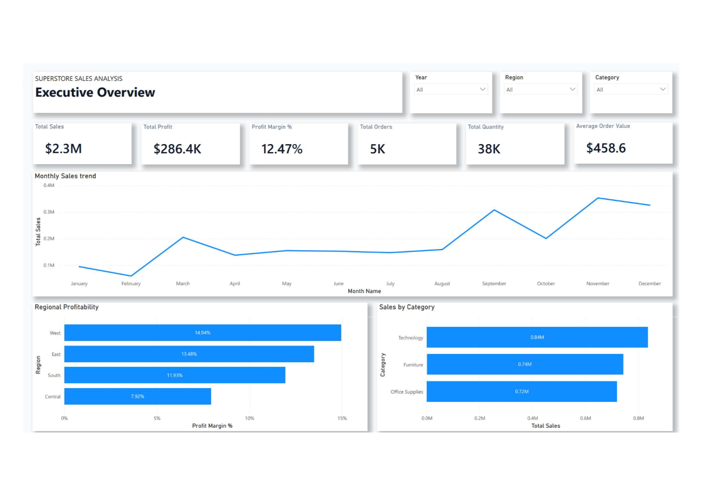
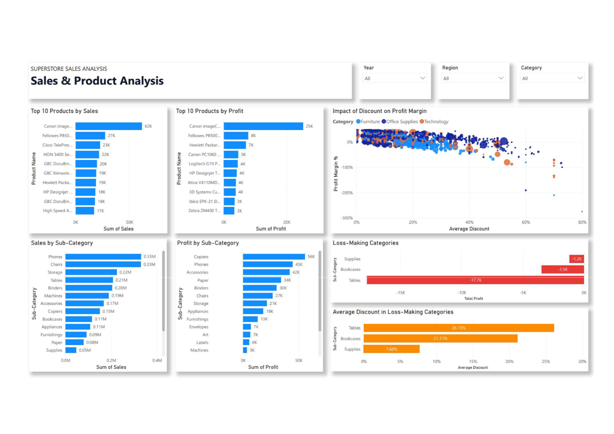
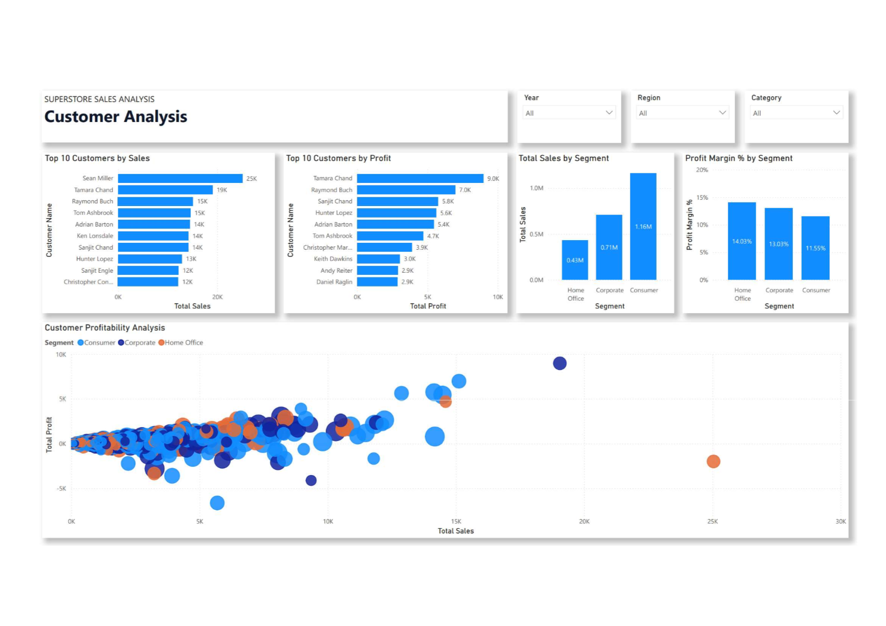
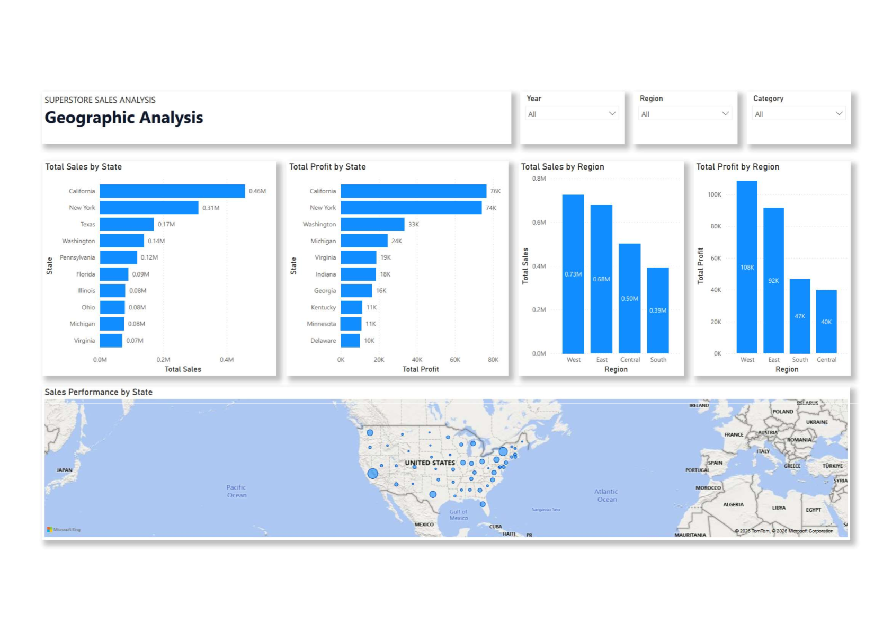
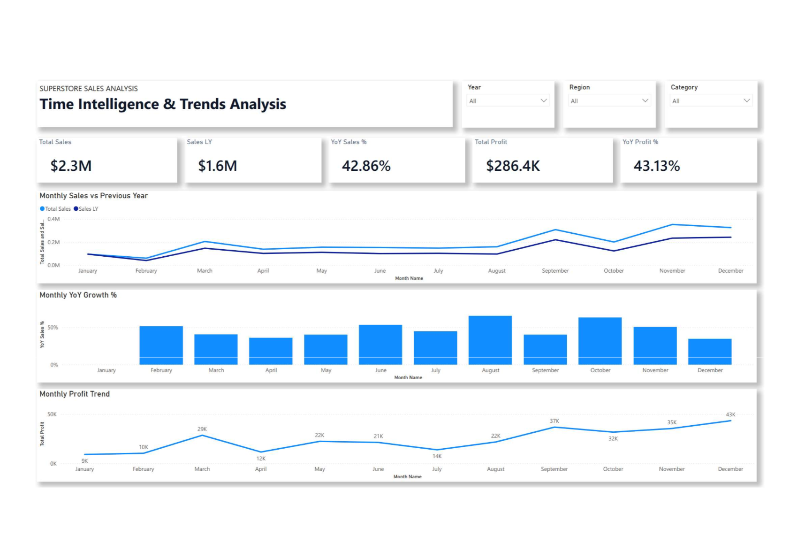

# Superstore Sales Analysis Dashboard

## Project Overview

This project presents a complete Business Intelligence solution built in Power BI using the Superstore Sales dataset.

The goal was to transform raw transactional sales data into actionable business insights through data modeling, DAX calculations, interactive visualizations, and business-focused analysis.

The dashboard enables stakeholders to evaluate:

- Revenue and profitability performance
- Product and category effectiveness
- Customer behavior and segmentation
- Geographic performance
- Year-over-Year business growth
- The impact of discounts on profitability

---

## Business Questions

This project was designed to answer the following business questions:

- Which products and categories generate the highest revenue and profit?
- Which regions and states perform best?
- Which customer segments are most valuable?
- How do discounts affect profitability?
- Which categories generate losses?
- Is the business growing over time?
- Are revenue and profit growing at the same pace?

---

## Dataset

**Source:** Kaggle – Superstore Sales Dataset

Dataset characteristics:

- ~10,000 sales transactions
- Multi-year historical data
- Customer, product, geographic, and financial information
- Sales, profit, quantity, discount, and shipping details

---

## Data Model

The report was built using a Star Schema model.

### Fact Table

- FactOrders

### Dimension Tables

- DimDate
- DimCustomer
- DimProduct
- DimLocation

### Modeling Highlights

- Separate Date Dimension for Time Intelligence
- Active Order Date relationship
- Inactive Ship Date relationship
- Dedicated Measure Table
- Optimized one-to-many relationships

**Screenshot**

---

## Dashboard Pages

### Executive Overview

Provides a high-level summary of business performance.

Features:

- Total Sales
- Total Profit
- Profit Margin
- Total Orders
- Total Quantity
- Average Order Value (AOV)

**Screenshot**

---

### Sales & Product Analysis

Analyzes product and category performance.

Features:

- Sales by Category
- Sales by Sub-Category
- Discount vs Profitability Analysis
- Loss-Making Categories
- Root Cause Investigation

**Screenshot**

---

### Customer Analysis

Explores customer behavior and profitability.

Features:

- Top Customers by Sales
- Top Customers by Profit
- Customer Segmentation
- Customer Profitability Analysis

**Screenshot**

---

### Geographic Analysis

Evaluates regional and state-level performance.

Features:

- Sales by Region
- Profitability by Region
- State Performance Map
- Geographic Profitability Comparison

**Screenshot**

---

### Time Intelligence & Trends

Analyzes business growth over time.

Features:

- Monthly Sales vs Previous Year
- Year-over-Year Sales Growth
- Monthly Profit Trends

**Screenshot**

---

## Key Business Insights

### Revenue & Profitability

- Total Sales reached **$2.30M**
- Total Profit reached **$286K**
- Overall Profit Margin was **12.47%**
- Average Order Value reached **$458.61**

### Seasonal Trends

- November and December consistently generated the highest sales volume.
- Early-year performance was significantly weaker.
- Sales patterns indicate strong holiday-driven demand.

### Product Performance

- Technology was the strongest-performing category in both sales and profit.
- Tables, Bookcases, and Supplies were identified as loss-making categories.
- Higher discount levels were associated with lower profit margins.

### Customer Insights

- The Consumer segment generated the highest revenue.
- The Home Office segment delivered the strongest profitability.
- A relatively small group of customers generated a disproportionately large share of revenue.

### Geographic Insights

- California generated both the highest sales and highest profit.
- West Region outperformed all other regions.
- Pennsylvania and Florida generated significant revenue but delivered relatively weak profitability, suggesting margin optimization opportunities.

### Growth Trends

- Sales grew by **42.86% YoY**
- Profit grew by **43.13% YoY**
- Revenue growth was closely matched by profit growth, indicating healthy and sustainable expansion.

---

## Technical Skills Demonstrated

### Data Preparation

- Power Query
- Data Cleaning
- Data Transformation

### Data Modeling

- Star Schema Design
- Relationship Management
- Fact & Dimension Modeling

### DAX

- Aggregation Measures
- Time Intelligence Functions
- Running Totals
- YoY Analysis
- Profitability Metrics

### Visualization

- Interactive Dashboards
- Geographic Analysis
- Customer Segmentation
- Executive Reporting

---

## Tools Used

- Power BI Desktop
- Power Query
- DAX
- Kaggle Dataset

---

## Author

**Gergő Antal**

Power BI Data Analyst (PL-300)  
Data Analytics | Business Intelligence | Data Visualization
